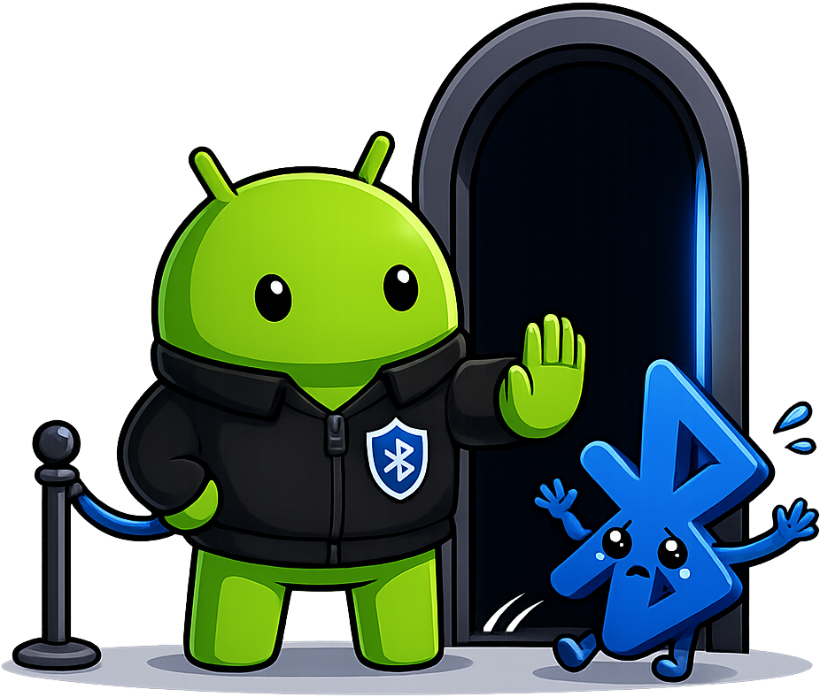
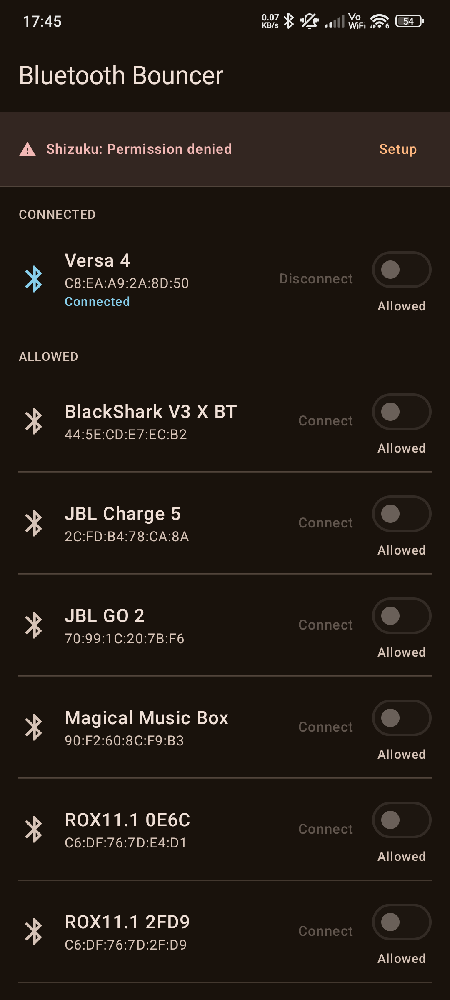
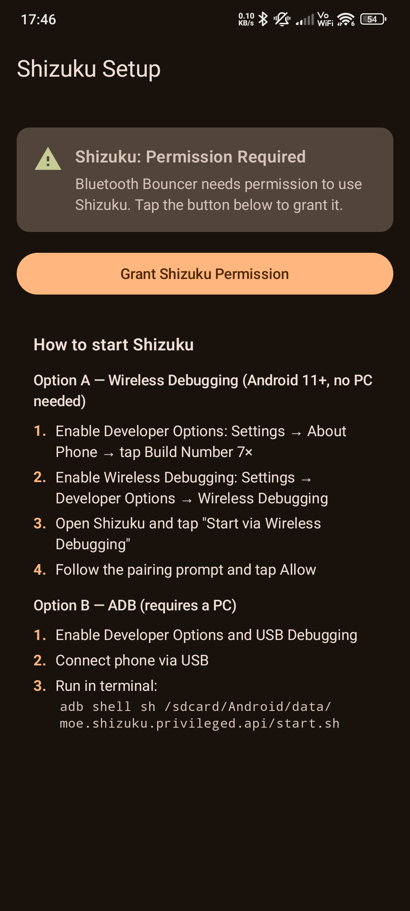
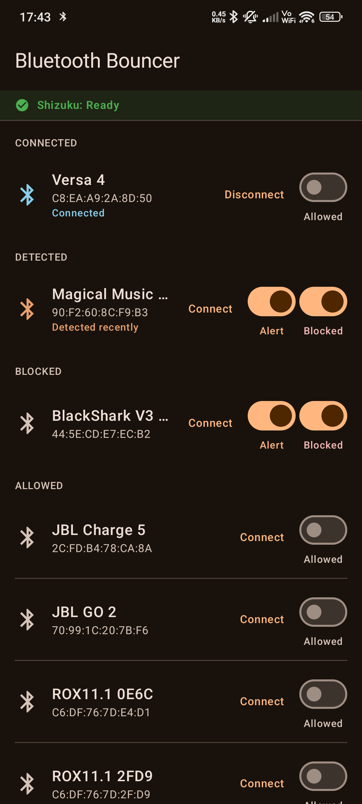
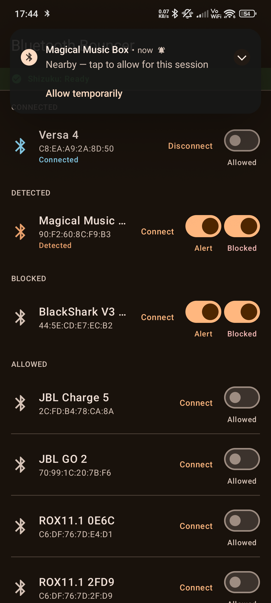
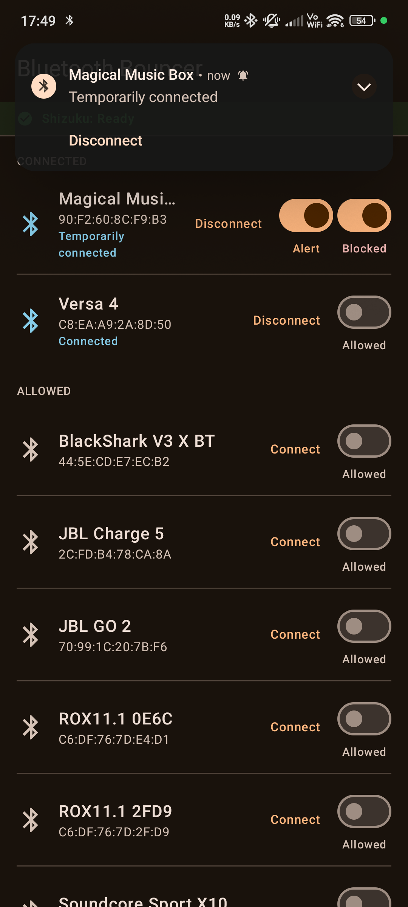

# Bluetooth Bouncer

<p align="center">
  
</p>

<p align="center"><em>"Sorry mate, not tonight."</em></p>

---

Android auto-connects to every paired Bluetooth device in range. The only built-in fix is to unpair entirely.

Bluetooth Bouncer adds a missing toggle: per-device control over auto-connect. Stay paired, connect only when you want to.

## Screenshots

<table align="center">
  <tr>
    <td align="center">
      <br>
      <em>How the apps looks on first open</em>
    </td>
    <td align="center">
      <br>
      <em>Shizuku setup guide</em>
    </td>
    <td align="center">
      <br>
      <em>Main device list</em>
    </td>
  </tr>
  <tr>
    <td align="center">
      <br>
      <em>Notification when a device has turned on</em>
    </td>
    <td align="center">
      <br>
      <em>Notification after turning on a device</em>
    </td>
    <td></td>
  </tr>
</table>

## Demo video

<p align="center">
  <a href="https://www.youtube.com/watch?v=86Numx74dek">
    
  </a>
  <br>
  <em>▶ Watch the demo on YouTube</em>
</p>

## Features

| Feature | What it does |
|---------|-------------|
| **Block / Allow** | Toggle auto-connection per device. Blocked devices stay paired but won't connect on their own. |
| **Connect / Disconnect** | Tap Connect to immediately connect a device (temporarily allows blocked devices; allowed devices connect directly). Tap Disconnect to kick a connected device off. *(Android 13+ only)* |
| **Alerts** | Get notified when a blocked device comes into range, so you can decide whether to let it in. *(Android 13+ only)* |
| **Temporary Allow** | Tap the notification to let a blocked device connect just for this session. It goes back to blocked automatically when the device leaves range. Also triggered by the Connect button on a blocked device. |
| **Survives Reboots** | Your blocks stick around even after restarting your phone. |
| **Re-pair Protection** | If you unpair and re-pair a blocked device, the block is automatically re-applied. No surprise reconnections. |
| **Live Status** | See at a glance which devices are connected, detected nearby, or were recently seen. |

## Requirements

- **Android 12 or higher** (API 31+)
- **[Shizuku](https://github.com/RikkaApps/Shizuku)** — a free app that gives Bluetooth Bouncer the elevated access it needs. Android normally restricts the connection-policy API to system apps; Shizuku bridges that gap without requiring root. Bluetooth Bouncer will guide you through setup if Shizuku isn't running.

> **Alert and Connect/Disconnect features** require Android 13+ (API 33+). The toggles and buttons simply won't appear on older versions.

> **Note on Disconnect for allowed devices:** Disconnecting an allowed device sends a disconnect signal to its Bluetooth profiles, but Android may immediately reconnect it because the connection policy is still "allowed." If you want a persistent disconnect, use the Block toggle instead.

## Tested With

This app has only been tested with the following setup — it may work on other devices and configurations, but no guarantees:

- **Phone:** Xiaomi POCO X5 Pro
- **Bluetooth devices:** Razer BlackShark V3 X (BT), JBL Go 4
- **Shizuku:** v13.6.0

## Getting Started

1. **Install Bluetooth Bouncer** — download the latest APK from [GitHub Releases](https://github.com/harvzor/android-bluetooth-bouncer/releases) and install it on your phone.
2. **Install [Shizuku](https://github.com/RikkaApps/Shizuku)** from the Play Store or GitHub.
3. **Start Shizuku** — tap "Setup" in Bluetooth Bouncer and follow the instructions. You can use either Wireless Debugging (no PC needed) or ADB from a computer.
4. **Grant permission** — Bluetooth Bouncer will ask for Shizuku permission the first time. Tap Allow.
5. **Block a device** — you'll see all your paired Bluetooth devices. Flip the toggle next to any device to block it.

That's it. The device will stay paired but won't auto-connect anymore.

## How It Works

Android has a hidden system API called `setConnectionPolicy` that controls whether a Bluetooth device is permitted to auto-connect. It's normally off-limits to third-party apps — only system apps can use it.

Shizuku runs a small background process with elevated shell privileges, and Bluetooth Bouncer uses it to call this API on your behalf. No root required.

Because the policy is applied at the OS level, it persists even when Bluetooth Bouncer isn't running. There's no background service draining your battery — once a device is blocked, Android itself enforces it.

## Permissions

| Permission | Why |
|------------|-----|
| Bluetooth Connect | Read your list of paired devices and interact with Bluetooth profiles |
| Notifications | Alert you when a blocked device is nearby (you can decline this) |
| Receive Boot Completed | Re-apply your blocks after restarting your phone |
| Companion Device Presence | Detect when blocked devices come into or leave range (for the Alert feature) |

## Uninstalling

Because blocks are applied at the OS level (see [How It Works](#how-it-works)), they persist even after Bluetooth Bouncer is uninstalled. Android does not give apps a chance to clean up before removal.

**Before uninstalling**, open Bluetooth Bouncer and unblock any devices you want to auto-connect again.

**If you already uninstalled** with devices still blocked, you can fix them from Android's Bluetooth settings — tap the blocked device to connect manually, and the policy will be reset.

## Building

The only host dependency is Docker (BuildKit-capable). No Android SDK, JDK, or Gradle installation required.

```bash
docker build --output=out .
```

The APK is written to `./out/app-debug.apk`.

To build a signed release APK locally (requires a keystore — see [Releases](#releases)):

```bash
RELEASE_STORE_PASSWORD=<store-password> \
RELEASE_KEY_ALIAS=release \
RELEASE_KEY_PASSWORD=<key-password> \
docker build \
  --build-arg BUILD_TYPE=release \
  --build-arg VERSION=1.0.0 \
  --secret id=keystore,src=./release.keystore \
  --secret id=store_password,env=RELEASE_STORE_PASSWORD \
  --secret id=key_alias,env=RELEASE_KEY_ALIAS \
  --secret id=key_password,env=RELEASE_KEY_PASSWORD \
  --output=out \
  .
```

The signed APK is written to `./out/bluetooth-bouncer-<version>.apk`.

## Releases

Pushing a version tag triggers an automated GitHub Actions workflow that builds a signed release APK and attaches it to the corresponding GitHub Release:

```bash
git tag v1.0.0
git push origin v1.0.0
```

### Signing

Release APKs are signed inside the Docker build using a keystore stored as GitHub Actions secrets. The keystore is mounted as a BuildKit secret (never baked into any image layer). Four repository secrets must be configured:

| Secret | Description |
|--------|-------------|
| `RELEASE_KEYSTORE_BASE64` | Base64-encoded keystore file |
| `RELEASE_KEYSTORE_PASSWORD` | Keystore store password |
| `RELEASE_KEY_ALIAS` | Key alias within the keystore |
| `RELEASE_KEY_PASSWORD` | Key password |

To generate a keystore and populate these secrets for the first time:

```bash
# 1. Generate the keystore
keytool -genkeypair -v \
  -keystore release.keystore \
  -alias release \
  -keyalg RSA -keysize 2048 -validity 10000 \
  -storepass <store-password> -keypass <key-password>

# 2. Add secrets to GitHub
gh secret set RELEASE_KEYSTORE_BASE64 --body "$(base64 -w0 release.keystore)"
gh secret set RELEASE_KEYSTORE_PASSWORD --body "<store-password>"
gh secret set RELEASE_KEY_ALIAS --body "release"
gh secret set RELEASE_KEY_PASSWORD --body "<key-password>"
```

> **Keep the keystore safe.** If it is lost, APKs signed with a new keystore will be treated by Android as a different app — existing users will need to uninstall and reinstall.

## App Icon

The launcher icon source image is `icon.png` in the repo root (transparent background). To regenerate or update it:

1. Replace `icon.png` with the new source image
2. In Android Studio, right-click `app/src/main/res/` → **New → Image Asset**
3. **Icon Type**: Launcher Icons (Adaptive and Legacy)
4. **Foreground Layer**: select `icon.png`; adjust the resize slider so the character fits within the safe zone circle
5. **Background Layer**: Color → `#FFFFFF` (white)
6. Click **Next → Finish** — this overwrites all `mipmap-*` directories automatically

The manifest already references `@mipmap/ic_launcher` and `@mipmap/ic_launcher_round`, so no manifest changes are needed after regenerating.
